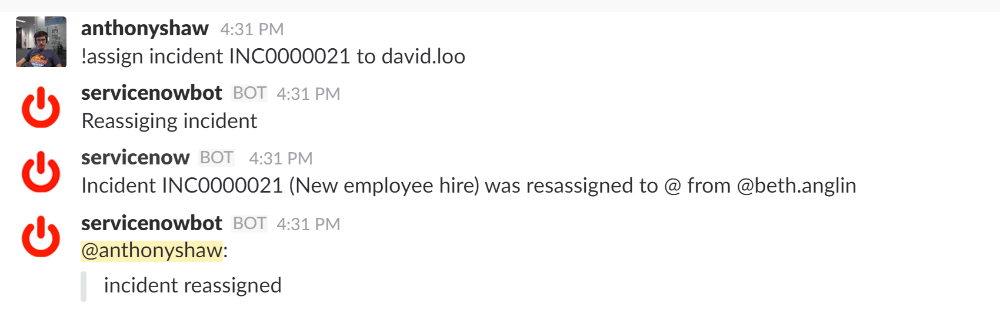

# ServiceNow Hackathon

The purpose of this hackathon entry was to integrate Slack into ServiceNow enabling support engineers to interact with ServiceNow and receive notifications.
The focus was incidents but the code is reusable.

[Demo](https://youtu.be/rwyhp_CgKKI)

## Configuring a Slack app

Before you start you need a Slack team.

In Slack, add an application under the integrations panel, this will also give you the chance to issue a developer token. You will need this to authenticate

## Add the REST configuration in ServiceNow

Once you have an auth token, an application ID and a botname (and more importantly a cool icon), setup the REST service action in ServiceNow


Once this is done, add a Script Include so this can be used from a business rule or UI script

```javascript
var SlackMessageNotifier = Class.create();
SlackMessageNotifier.prototype = Object.extendsObject(AbstractAjaxProcessor, {

    type: 'SlackMessageNotifier',
    'sendMessage': function (message) {
        // Create and send the REST Message
        var r = new sn_ws.RESTMessageV2('Slack', 'get');
        r.setStringParameter('text', message);
        var response = r.execute();
        return response;
    },
});
```

### Example business rule

Now you can setup a  business rule, I tried checking when the incident table changes and the assigned_to field has been modified. I also added a slack_username field to the sys_user table.

This is the script of the rule

```javascript
(function executeRule(current, previous /*null when async*/) {
	gs.info("Hello I fired");
	var request = new SlackMessageNotifier();
    request.sendMessage("Incident " + current.number.toString() + " (" + current.short_description + ") was resassigned to @" + current.assigned_to.u_slack_username.getDisplayValue() + " from " +
					   (previous.assigned_to != null ? "@"+previous.assigned_to.u_slack_username.getDisplayValue() : "nobody"));
	gs.info("Yey I finished");
})(current, previous);
```

Testing that out, you will see a message in your Slack channel


### Communication back the other way

I setup 3 bot commands to coordinate the rule the other way around, this was using [StackStorm](http://stackstorm.com/) as my Python engine and all round awesome-sauce as well as Github Hubot.

All my code for the integration from Slack to ServiceNow is [In this branch](https://github.com/tonybaloney/st2contrib/tree/feature/servicenow/packs/servicenow)

I will contribute this upstream to StackStorm...

My first integration showing getting a list of incidents for a user, this is the Hubot configuration


```yaml
---
name: "servicenow.get_incidents_assigned_to"
action_ref: "servicenow.get_incidents_assigned_to"
description: "Get a list of incidents assigned to a particular username"
formats:
    - "incidents assigned to {{name}}"
ack:
    format: "Finding all incidents assigned "
result:
  format: |
    
    found some incidents for you: {~}
    
    {{ loop.index }}. *{{ incident.number }}*: {{incident.short_description}}
    
    
    couldn't find anything, sorry!
    
```

And then an action-chain workflow to first fetch the user with the name requested, then all incidents assigned. You could adapt the query to show certain incidents.

```yaml
---
    chain:
        -
            name: "getUser"
            ref: "servicenow.get_non_structured"
            parameters:
                table: "sys_user"
                query: "user_name={{name}}"
            on-success: getIncidents
            publish:
                user_id: "{{getUser.result[0].sys_id}}"
        -
            name: "getIncidents"
            ref: "servicenow.get_non_structured"
            parameters:
                table: "incident"
                query: "assigned_to={{user_id}}"
            publish:
                incidents: "{{getIncidents.result}}"
```

Then I did incident assignment, which was a little more complex, this is the hubot config



```yaml
---
name: "servicenow.assign_incident_to"
action_ref: "servicenow.assign_incident_to"
description: "Assign an incident to a username"
formats:
    - "assign incident {{number}} to {{name}}"
ack:
    format: "Reassiging incident"
result:
    format: "incident reassigned"
```

then the workflow

```yaml
---
    chain:
        -
            name: "getUser"
            ref: "servicenow.get_non_structured"
            parameters:
                table: "sys_user"
                query: "user_name={{name}}"
            on-success: setIncidents
            publish:
                user_id: "{{getUser.result[0].sys_id}}"
        -
            name: "setIncidents"
            ref: "servicenow.set_incident_owner"
            parameters:
                number: "{{number}}"
                user_id: "{{user_id}}"
            publish:
                incidents: "{{setIncidents.result}}"
```

This time I had to write a little Python to automate the assignment of the incident owner

```python
from lib.actions import BaseAction


class AssignIncidentToAction(BaseAction):
    def run(self, user_id, number):
        s = self.client
        s.table='incident'
        res = s.get({'number': number})
        sys_id = res[0]['sys_id']
        response = s.update({'assigned_to': user_id}, sys_id) 
        return response

```

And lastly, approving a Change Request


```yaml
---
name: "servicenow.approve_change"
action_ref: "servicenow.approve_change"
description: "Set the approval status of a Change Request to approved."
formats:
    - "approve {{number}}"
ack:
    format: "Approving change"
result:
    format: "Change approved"
```

And the Python
```python
from lib.actions import BaseAction


class ApprovalAction(BaseAction):
    def run(self, number):
        s = self.client
        s.table='change_request'
        res = s.get({'number': number})
        sys_id = res[0]['sys_id']
        response = s.update({'approval': 'approved'}, sys_id) 
        return response

```